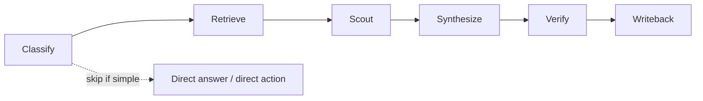
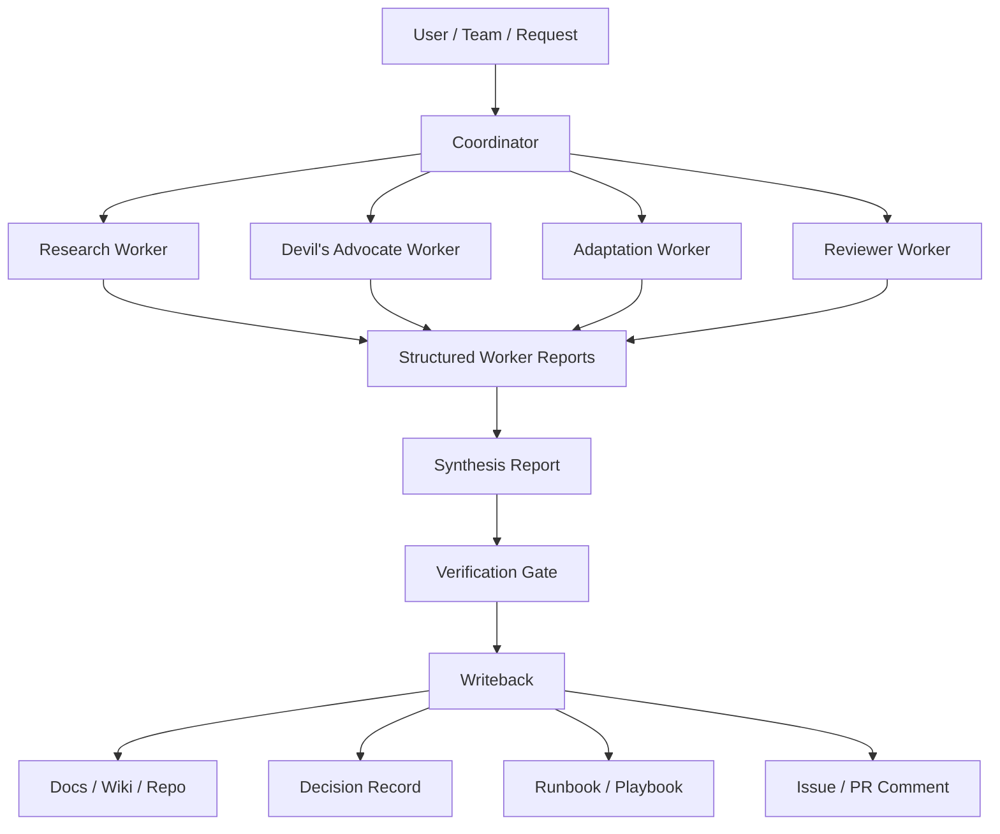
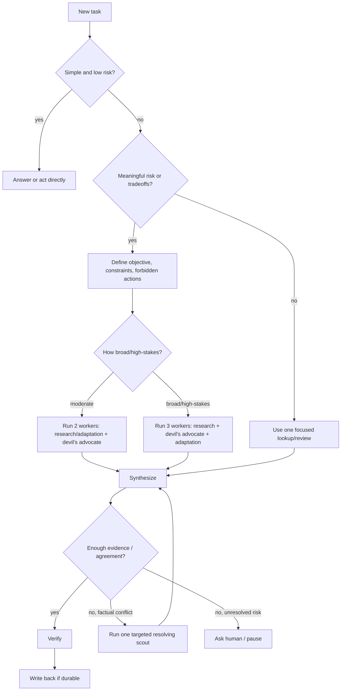
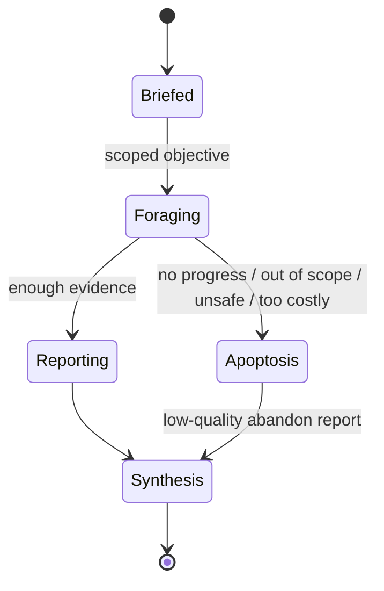
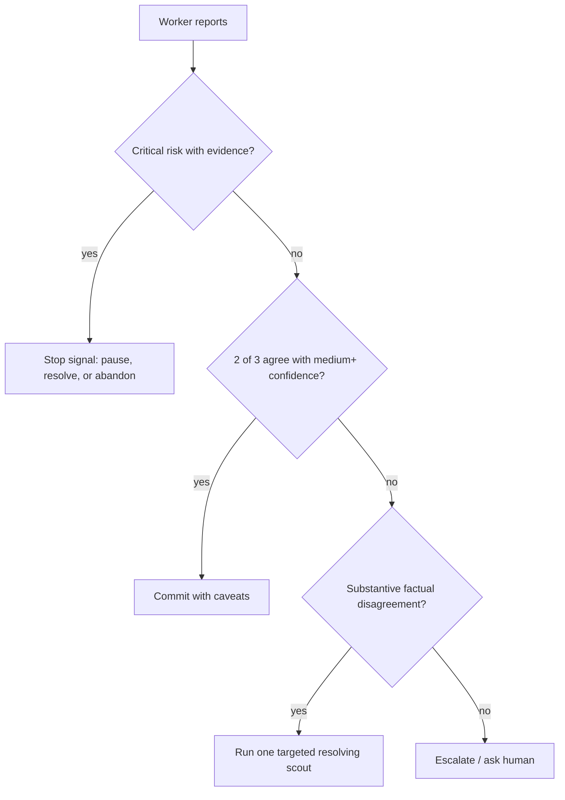
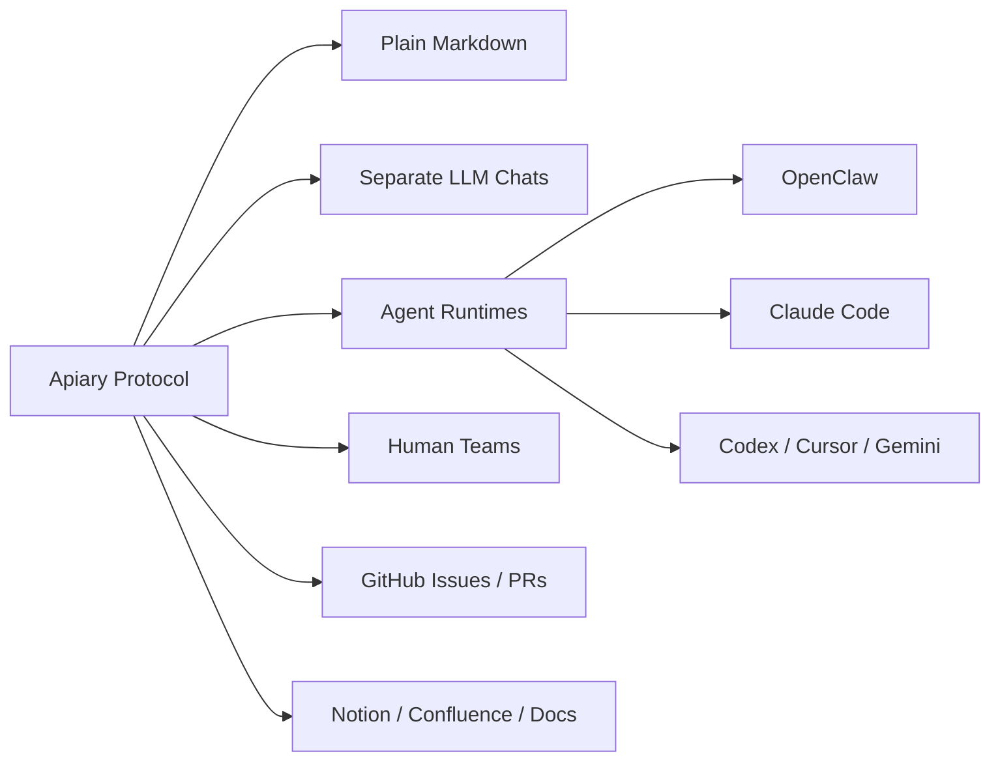

# Apiary Diagrams

This page shows how Apiary works using Mermaid diagrams. GitHub renders these diagrams automatically.

## Core workflow

Apiary starts by deciding whether a task deserves multi-perspective work. Simple tasks stay direct. Complex or risky tasks move through retrieval, workers, synthesis, verification, and durable writeback.

## Roles and artifacts

The coordinator owns the final decision. Workers provide bounded perspectives. Durable writeback keeps useful learning from disappearing into chat history.

## Decision routing

Apiary is not “always swarm.” It defaults to direct work unless independent perspectives add value.

## Worker lifecycle

Workers should stop cleanly when they are stuck, unsafe, or outside scope. This avoids runaway exploration.

## Quorum and stop signals

A concrete devil's-advocate or reviewer risk can outweigh multiple optimistic workers until resolved.

## Platform independence

The protocol is the stable center. Adapters map Apiary to specific tools.
