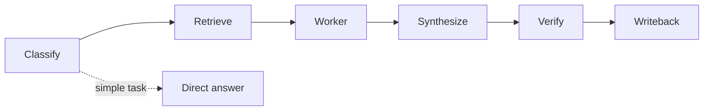

# Apiary Protocol

A portable hivemind workflow for AI agents and teams.

Apiary helps a coordinator use multiple workers to explore, challenge, synthesize, verify, and preserve decisions — without requiring a new runtime, LLM provider, database, or tool stack.

> Coordinated workers, structured synthesis, durable learning — without a new runtime.


## Visual overview



See [DIAGRAMS.md](DIAGRAMS.md) for architecture, decision routing, worker lifecycle, quorum, and adapter diagrams.

See [protocol/model-routing.md](protocol/model-routing.md) for provider-agnostic model role routing and zero-config defaults.

## Why use Apiary?

AI agents are good at producing answers quickly, but complex decisions often need more than one perspective. Apiary gives you a lightweight way to ask multiple bounded workers to investigate different angles, then combine their findings into one verified decision.

Use Apiary when you want to:

- reduce blind spots before adopting a tool or architecture,
- add a devil's advocate without derailing the whole task,
- compare evidence from multiple sources,
- keep useful decisions and workflows from disappearing into chat history,
- make multi-agent or multi-reviewer work structured instead of chaotic,
- get some of the benefit of swarm/hivemind workflows without installing a new runtime.

Apiary is intentionally small: it is a protocol, not a platform. You can use it with AI agents, normal LLM chats, human teammates, GitHub issues, docs, or any combination of those.


## Optional monitor: Honey ComBoard

Apiary includes a lightweight local monitor for swarm/worker runs:

- terminal view: `node scripts/apiary-monitor.mjs`
- visual dashboard, **Honey ComBoard**: `node scripts/apiary-serve-monitor.mjs 8765`

The monitor is intentionally no-dependency and file-backed. Apiary writes normalized run ledger JSON under `runs/`; terminal and visual views read that ledger. Honey ComBoard is read-only, mobile-friendly, and can be exposed through Tailscale Serve for trusted tailnet use.

Dashboard controls:

- **Privacy** toggles glance/screen-share privacy. It hides details until intentional selection, but does not encrypt or access-control raw ledger JSON.
- **Focus** toggles a calmer no-motion view and displays an obvious on/off state.
- **Refresh** reloads the latest ledger and gives tap feedback.

**Report preview & detail pages**

The dashboard shows a compact report preview inline for workers that have reported structured findings. Tap a worker row to expand it:

- **Preview card** shows:
  - Report headline (bold line)
  - Up to 3 bullet points from `reportBullets`
  - "Show preview" / "Hide preview" toggle (collapsed by default on mobile)
  - "View full report" button that opens the dedicated worker detail page in a new tab.

- **Full report page** (`worker.html?run=<runId>&worker=<workerId>`):
  - Shows all structured sections: Doing, Accomplished, Findings, Artifacts, Files touched, Next steps, Risks
  - Fetches the full report artifact if `reportPath` is present in the ledger
  - Falls back to ledger summary if the report file is missing
  - All text is sanitized via `safeText()` to prevent XSS
  - Back link returns to the dashboard

Zombie-worker prevention:

- `node scripts/apiary-run.mjs sweep-stale --run <run-id> --older-than-minutes 5` marks old active workers as `stale` and records a warning event.
- Honey ComBoard runs that sweep before serving run JSON so old `Gathering` workers do not stay active-looking forever.
- `apiary-run complete` refuses unfinished workers unless explicitly forced.

Security/privacy note: dashboard privacy mode is display/glance privacy only. Treat the monitor as a local/trusted-tailnet tool.

See [protocol/worker-taxonomy.md](protocol/worker-taxonomy.md), [protocol/monitor-implementation-plan.md](protocol/monitor-implementation-plan.md) and [adapters/openclaw/monitor.md](adapters/openclaw/monitor.md).

## Worker reports

Apiary workers can produce structured reports that appear both inline in the dashboard and on a dedicated detail page. The report system keeps the run ledger small while allowing rich information to be retrieved on demand.

### Ledger report fields (preview)

Workers can add these optional fields to their scout entry in the ledger:

| Field | Type | Description |
|---|---|---|
| `reportHeadline` | `string` | One-line summary of findings
| `reportBullets` | `string[]` | Key bullet points (max 5)
| `reportPath` | `string` | Path to the full report artifact file (e.g., `reports/run-abc-worker1.json`)
| `reportUpdatedAt` | `string` (ISO) | When this report was last updated
| `reportStatus` | `"partial" \| "final"` | Whether the report is interim or complete

These fields are **optional** and backward-compatible with older runs that omit them.

### Producing a report via CLI

The `apiary-run` script accepts flags for report metadata when updating or completing a worker:

```bash
# While a run is active, update a worker with report data
node scripts/apiary-run.mjs worker-update \
  --run <run-id> \
  --id <worker-id> \
  --summary "Summary text" \
  --report-headline "Key finding in one line" \
  --report-bullet "First evidence" \
  --report-bullet "Second evidence" \
  --report-path "reports/<run-id>-<worker-id>.json" \
  --report-status partial

# On completion, mark report as final
node scripts/apiary-run.mjs worker-complete \
  --run <run-id> \
  --id <worker-id> \
  --report-status final
```

Validation:

- `--report-path` is validated to stay within the project directory
- `--report-bullet` can be repeated (up to 5 bullets total)
- `--report-headline` max 120 characters
- `--report-status` accepts only `partial` or `final`

### Full report artifact format

When `--report-path` is supplied, the CLI records the report artifact path in the run ledger. The worker/coordinator should write the JSON report file at that path using this shape (see `schema/report-schema.json`):

```json
{
  "runId": "run-abc",
  "workerId": "worker1",
  "doing": "What the worker was working on",
  "accomplished": ["Completed task A", "Finished subtask B"],
  "findings": ["Observation 1", "Observation 2"],
  "artifacts": [{"label": "Analysis doc", "path": "docs/analysis.md", "kind": "report"}],
  "filesTouched": ["src/foo.js", "tests/foo.test.js"],
  "nextSteps": ["Integrate changes", "Run CI"],
  "risks": ["Potential regression in edge case X"],
  "createdAt": "2026-04-30T01:00:00.000Z",
  "updatedAt": "2026-04-30T01:05:00.000Z"
}
```

Keep fields reasonably bounded (10–20 items per array) to keep files readable by humans and fast to load in the dashboard.

### Dashboard usage

1. Open the dashboard: `node scripts/apiary-serve-monitor.mjs 8765` then visit `http://localhost:8765`
2. Each worker row shows status, model, and last-seen age
3. Tap a row to expand inline details
4. If the worker has submitted report fields, an **inline report preview** card appears:
   - Headline in bold
   - Up to 3 bullets from `reportBullets`
   - "Show preview" / "Hide preview" toggle (collapsed by default on mobile)
   - "View full report" button → opens `worker.html?run=<runId>&worker=<workerId>`
5. Full report page shows all sections with safe text rendering
6. Back link returns to the dashboard

The dashboard auto-refreshes every 3 seconds. Reports are loaded from the ledger (preview) and from the separate report artifact (full page).

## How it works

Apiary separates a complex decision into clear roles and artifacts:

1. **Coordinator** decides whether Apiary is warranted and owns the final decision.
2. **Workers** investigate bounded perspectives, such as research, risk, adaptation, or review.
3. **Structured reports** make worker findings comparable.
4. **Synthesis** turns multiple worker reports into one recommendation.
5. **Verification** checks the recommendation before acting.
6. **Writeback** saves only durable learning to your docs, wiki, repo, or memory system.

You can run this manually with copy/paste, or adapt it to any agent runtime that supports subagents/reviewers.

## Get started: run your first Apiary

You do not need to install anything.

### 1. Pick a decision

Good first example:

```text
Should we adopt Tool X for our workflow, borrow patterns from it, or avoid it?
```

### 2. Choose workers

For most first runs, use two workers:

```text
Research worker: What does Tool X do? What evidence supports it?
Risk/reviewer worker: What are the risks, overlaps, costs, and failure modes?
```

For broader decisions, add:

```text
Adaptation worker: If useful, how could we borrow the idea without coupling to Tool X?
```

### 3. Create worker briefs

Copy `templates/worker-brief.md` once per worker and fill in:

- role,
- objective,
- minimal context,
- allowed actions,
- forbidden actions.

### 4. Ask workers for structured output

Use `templates/worker-output.yaml` so every worker returns:

- findings,
- evidence,
- confidence,
- recommendation,
- stop/recruit signal.

Workers can be:

- separate LLM chats,
- agent sub-tasks,
- human reviewers,
- GitHub issue comments,
- CI/review jobs.

### 5. Synthesize

Use `templates/synthesis-report.md` and `checklists/synthesis-checklist.md` to answer:

- where workers agree,
- where they disagree,
- which claims have evidence,
- what risks remain,
- what decision you recommend,
- how to verify it.

### 6. Verify

Pick the smallest meaningful verification gate:

- source check,
- test/lint/build,
- dry run,
- peer review,
- human approval,
- explicit blocker.

### 7. Write back

Use `checklists/writeback-checklist.md`. Save only what is durable:

- decision record,
- runbook/playbook,
- project docs,
- issue/PR comment,
- team wiki note.

Do not save raw worker chatter unless you need an audit trail.

## Usage modes

| Mode | Who it is for | How to use |
|---|---|---|
| Plain markdown | Anyone | Copy templates into docs/chats and run manually |
| AI chat | Users of ChatGPT/Claude/Gemini/etc. | Use one chat as coordinator and others as workers |
| Agent runtime | OpenClaw, Claude Code, Codex, Cursor, etc. | Map workers to subagents/reviewers using an adapter |
| Human team | Engineering/product/security teams | Assign worker roles to teammates and synthesize in docs/issues |
| GitHub workflow | Open source/project teams | Use issue/PR comments as worker reports and decision records |

Start with `adapters/plain-markdown/` if you are unsure.

## Why "Apiary"?

An apiary is a place where hives are kept. That maps cleanly to the workflow:

- **Coordinator / keeper:** the human or AI responsible for final judgment.
- **Workers / foragers:** independent agents, chats, humans, or reviewers exploring bounded questions.
- **Comb / substrate:** the durable place where useful decisions and procedures are written back.
- **Waggle dance:** structured worker reports that communicate direction, evidence, confidence, and recommendation.
- **Quorum:** the point where enough independent evidence supports a decision.

The name is intentionally architectural, not tool-specific. Apiary is the environment for coordinated intelligence; it does not require bees, OpenClaw, a specific LLM, or any particular software stack.

## Bio-inspired design

Apiary is inspired by biological collective intelligence: workers forage, structured reports act like waggle dances, durable docs form the shared substrate, and quorum/stop signals prevent chaotic over-exploration.

The bio framing is practical, not decorative: each mechanism maps to a workflow behavior that improves coordination, safety, or memory. See [BIO_INSPIRED.md](BIO_INSPIRED.md) for the full master correlation matrix.

## Workflow in practice

A typical Apiary run looks like this:

1. **Classify:** decide whether the task deserves a swarm or direct handling.
2. **Retrieve:** gather source evidence before asking workers to speculate.
3. **Worker:** assign 1-3 bounded workers.
4. **Synthesize:** compare worker outputs; identify agreement, disagreement, evidence, and risk.
5. **Verify:** run the smallest meaningful proof: source check, test, dry run, review, or approval.
6. **Writeback:** save only durable learning to the chosen substrate.

The result is not "more agents for everything." The result is disciplined parallel thinking when parallel thinking helps.

## When to use Apiary

Use Apiary for:
- architecture decisions
- tool/framework adoption
- complex research synthesis
- risky automation plans
- design reviews
- security/privacy/stability tradeoffs
- situations where a devil's advocate would materially improve the decision

Do **not** use Apiary for:
- simple factual questions
- small edits
- routine lookups
- tasks where coordination overhead exceeds value

## The flow

```text
Classify -> Retrieve -> Worker -> Synthesize -> Verify -> Writeback
```

## Minimum requirements

Apiary requires only:

1. a coordinator,
2. one or more workers/reviewers,
3. a structured worker report,
4. a durable place to save decisions,
5. a verification gate.

The coordinator can be a human, an AI assistant, a coding agent, or a team lead. Workers can be subagents, separate LLM chats, humans, CI jobs, reviewers, or issue commenters.


## Documentation

- [Quickstart](QUICKSTART.md)
- [Architecture](ARCHITECTURE.md)
- [Diagrams](DIAGRAMS.md)
- [Bio-Inspired Design](BIO_INSPIRED.md)
- [Technical Notes](TECHNICAL.md)
- [Protocol](protocol/apiary-protocol.md)
- [Decision Rules](protocol/decision-rules.md)
- [Safety Model](protocol/safety-model.md)
- [Contributing](CONTRIBUTING.md)

## Quick start

1. Read `protocol/apiary-protocol.md`.
2. Pick an adapter from `adapters/` or use `adapters/plain-markdown/`.
3. Copy `templates/worker-brief.md` and assign 1-3 workers.
4. Ask workers to return `templates/worker-output.yaml` shape.
5. Fill `checklists/synthesis-checklist.md`.
6. Verify before acting.
7. Save the decision using `checklists/writeback-checklist.md`.

## Core invariant

Workers advise. The coordinator decides.

## License

MIT License. See [LICENSE](LICENSE).
