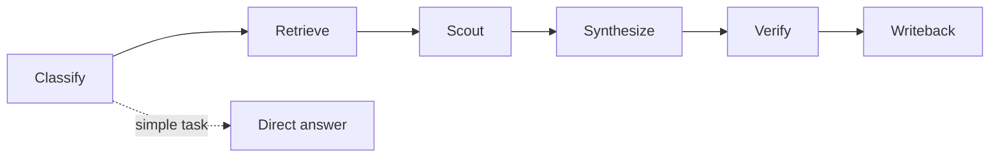

# Apiary Protocol

A portable hivemind workflow for AI agents and teams.

Apiary helps a coordinator use multiple scouts to explore, challenge, synthesize, verify, and preserve decisions — without requiring a new runtime, LLM provider, database, or tool stack.

> Coordinated scouts, structured synthesis, durable learning — without a new runtime.


## Visual overview



See [DIAGRAMS.md](DIAGRAMS.md) for architecture, decision routing, scout lifecycle, quorum, and adapter diagrams.

## Why use Apiary?

AI agents are good at producing answers quickly, but complex decisions often need more than one perspective. Apiary gives you a lightweight way to ask multiple bounded scouts to investigate different angles, then combine their findings into one verified decision.

Use Apiary when you want to:

- reduce blind spots before adopting a tool or architecture,
- add a devil's advocate without derailing the whole task,
- compare evidence from multiple sources,
- keep useful decisions and workflows from disappearing into chat history,
- make multi-agent or multi-reviewer work structured instead of chaotic,
- get some of the benefit of swarm/hivemind workflows without installing a new runtime.

Apiary is intentionally small: it is a protocol, not a platform. You can use it with AI agents, normal LLM chats, human teammates, GitHub issues, docs, or any combination of those.

## How it works

Apiary separates a complex decision into clear roles and artifacts:

1. **Coordinator** decides whether Apiary is warranted and owns the final decision.
2. **Scouts** investigate bounded perspectives, such as research, risk, adaptation, or review.
3. **Structured reports** make scout findings comparable.
4. **Synthesis** turns multiple scout reports into one recommendation.
5. **Verification** checks the recommendation before acting.
6. **Writeback** saves only durable learning to your docs, wiki, repo, or memory system.

You can run this manually with copy/paste, or adapt it to any agent runtime that supports subagents/reviewers.

## Get started: run your first Apiary

You do not need to install anything.

### 1. Pick a decision

Good first example:

```text
Should we adopt Tool X for our workflow, borrow patterns from it, or avoid it?
```

### 2. Choose scouts

For most first runs, use two scouts:

```text
Research scout: What does Tool X do? What evidence supports it?
Devil's advocate scout: What are the risks, overlaps, costs, and failure modes?
```

For broader decisions, add:

```text
Adaptation scout: If useful, how could we borrow the idea without coupling to Tool X?
```

### 3. Create scout briefs

Copy `templates/scout-brief.md` once per scout and fill in:

- role,
- objective,
- minimal context,
- allowed actions,
- forbidden actions.

### 4. Ask scouts for structured output

Use `templates/scout-output.yaml` so every scout returns:

- findings,
- evidence,
- confidence,
- recommendation,
- stop/recruit signal.

Scouts can be:

- separate LLM chats,
- agent sub-tasks,
- human reviewers,
- GitHub issue comments,
- CI/review jobs.

### 5. Synthesize

Use `templates/synthesis-report.md` and `checklists/synthesis-checklist.md` to answer:

- where scouts agree,
- where they disagree,
- which claims have evidence,
- what risks remain,
- what decision you recommend,
- how to verify it.

### 6. Verify

Pick the smallest meaningful verification gate:

- source check,
- test/lint/build,
- dry run,
- peer review,
- human approval,
- explicit blocker.

### 7. Write back

Use `checklists/writeback-checklist.md`. Save only what is durable:

- decision record,
- runbook/playbook,
- project docs,
- issue/PR comment,
- team wiki note.

Do not save raw scout chatter unless you need an audit trail.

## Usage modes

| Mode | Who it is for | How to use |
|---|---|---|
| Plain markdown | Anyone | Copy templates into docs/chats and run manually |
| AI chat | Users of ChatGPT/Claude/Gemini/etc. | Use one chat as coordinator and others as scouts |
| Agent runtime | OpenClaw, Claude Code, Codex, Cursor, etc. | Map scouts to subagents/reviewers using an adapter |
| Human team | Engineering/product/security teams | Assign scout roles to teammates and synthesize in docs/issues |
| GitHub workflow | Open source/project teams | Use issue/PR comments as scout reports and decision records |

Start with `adapters/plain-markdown/` if you are unsure.

## Why "Apiary"?

An apiary is a place where hives are kept. That maps cleanly to the workflow:

- **Coordinator / keeper:** the human or AI responsible for final judgment.
- **Scouts / foragers:** independent agents, chats, humans, or reviewers exploring bounded questions.
- **Comb / substrate:** the durable place where useful decisions and procedures are written back.
- **Waggle dance:** structured scout reports that communicate direction, evidence, confidence, and recommendation.
- **Quorum:** the point where enough independent evidence supports a decision.

The name is intentionally architectural, not tool-specific. Apiary is the environment for coordinated intelligence; it does not require bees, OpenClaw, a specific LLM, or any particular software stack.

## Bio-inspired design

Apiary borrows mechanisms from biological collective intelligence because they solve the same problems multi-agent AI workflows face: exploration cost, noisy signals, stale memory, local autonomy, negative feedback, and convergence.

The bio metaphor is not decoration. Each mechanism corresponds to an engineering behavior:

| Bio pattern | Natural function | Apiary workflow | Why it matters |
|---|---|---|---|
| Queen pheromone | Colony coherence | Coordinator owns synthesis | Prevents leaderless chaos |
| Foraging | Parallel exploration | Scouts investigate bounded questions | Gets breadth without one giant context |
| Waggle dance | Compressed report with quality signal | Structured scout output | Makes synthesis cheaper and more reliable |
| Stigmergy | Coordination through traces in the environment | Writeback to docs/runbooks/decisions | Lets future runs learn without hidden memory |
| Quorum sensing | Commit after enough convergent signal | Decision rules | Avoids both premature decisions and endless scouting |
| Stop signal | De-recruit from bad/depleted paths | Abort or down-rank risky proposals | Prevents sunk-cost continuation |
| Apoptosis | Clean self-termination | Scout stop conditions | Reduces loops, scope creep, and wasted tokens |
| Pheromone decay | Old trails fade | Memory/document review and pruning | Keeps stale decisions from dominating |
| Innate immunity | Fast generic threat detection | Plan-screen checklist | Catches obvious safety issues cheaply |
| Adaptive immunity | Slow specific learned defense | Devil's advocate scout | Catches subtle, context-specific risk |

## Master correlation matrix

| Bio pattern | Natural function | Apiary system pattern | Generic mechanism | Status |
|---|---|---|---|---|
| Queen pheromone | Identity/coherence signal | Coordinator authority | Human/AI lead owns final synthesis | Core |
| Worker bees / foragers | Parallel exploration | Scouts | Agents, humans, chats, reviewers, CI jobs | Core |
| Stigmergy | Trace-based coordination | Durable substrate | Docs, wiki, repo, notes, decision log | Core |
| Waggle dance | Structured location/quality report | Scout output schema | YAML/JSON/markdown report | Core |
| Apoptosis | Self-termination | Scout stop conditions | Scope/cost/confidence limits | Core |
| Stop signal | Negative feedback | Abort bad paths | Devil's advocate/reviewer veto | Core |
| Quorum sensing | Evidence-weighted convergence | Decision threshold | 2-of-3, targeted resolving scout | Core |
| Adaptive immunity | Learned defense | Devil's advocate | Risk/security/privacy review | Core |
| Innate immunity | Cheap generic defense | Plan screen | Checklist/static checks | Optional |
| Pheromone decay | Memory aging | Review/prune durable knowledge | Docs review, archive, decay metadata | Optional |
| Symbiosis | Stable specialist relationship | Persistent specialist | Domain expert, recurring agent/session | Optional |
| Mycelium / pull-based flow | Nutrients move on demand | Lazy context loading | Minimal context, source retrieval first | Principle |
| Circadian rhythm | Phased cycles | Workflow stages | Classify -> retrieve -> scout -> synthesize -> verify -> writeback | Principle |

## Workflow in practice

A typical Apiary run looks like this:

1. **Classify:** decide whether the task deserves a swarm or direct handling.
2. **Retrieve:** gather source evidence before asking scouts to speculate.
3. **Scout:** assign 1-3 bounded perspectives.
4. **Synthesize:** compare scout outputs; identify agreement, disagreement, evidence, and risk.
5. **Verify:** run the smallest meaningful proof: source check, test, dry run, review, or approval.
6. **Writeback:** save only durable learning to the chosen substrate.

The result is not "more agents for everything." The result is disciplined parallel thinking when parallel thinking helps.

## When to use Apiary

Use Apiary for:
- architecture decisions
- tool/framework adoption
- complex research synthesis
- risky automation plans
- design reviews
- security/privacy/stability tradeoffs
- situations where a devil's advocate would materially improve the decision

Do **not** use Apiary for:
- simple factual questions
- small edits
- routine lookups
- tasks where coordination overhead exceeds value

## The flow

```text
Classify -> Retrieve -> Scout -> Synthesize -> Verify -> Writeback
```

## Minimum requirements

Apiary requires only:

1. a coordinator,
2. one or more scouts/reviewers,
3. a structured scout report,
4. a durable place to save decisions,
5. a verification gate.

The coordinator can be a human, an AI assistant, a coding agent, or a team lead. Scouts can be subagents, separate LLM chats, humans, CI jobs, reviewers, or issue commenters.


## Documentation

- [Quickstart](QUICKSTART.md)
- [Architecture](ARCHITECTURE.md)
- [Diagrams](DIAGRAMS.md)
- [Technical Notes](TECHNICAL.md)
- [Protocol](protocol/apiary-protocol.md)
- [Decision Rules](protocol/decision-rules.md)
- [Safety Model](protocol/safety-model.md)
- [Contributing](CONTRIBUTING.md)

## Quick start

1. Read `protocol/apiary-protocol.md`.
2. Pick an adapter from `adapters/` or use `adapters/plain-markdown/`.
3. Copy `templates/scout-brief.md` and assign 1-3 scouts.
4. Ask scouts to return `templates/scout-output.yaml` shape.
5. Fill `checklists/synthesis-checklist.md`.
6. Verify before acting.
7. Save the decision using `checklists/writeback-checklist.md`.

## Core invariant

Scouts advise. The coordinator decides.

## License

MIT License. See [LICENSE](LICENSE).
